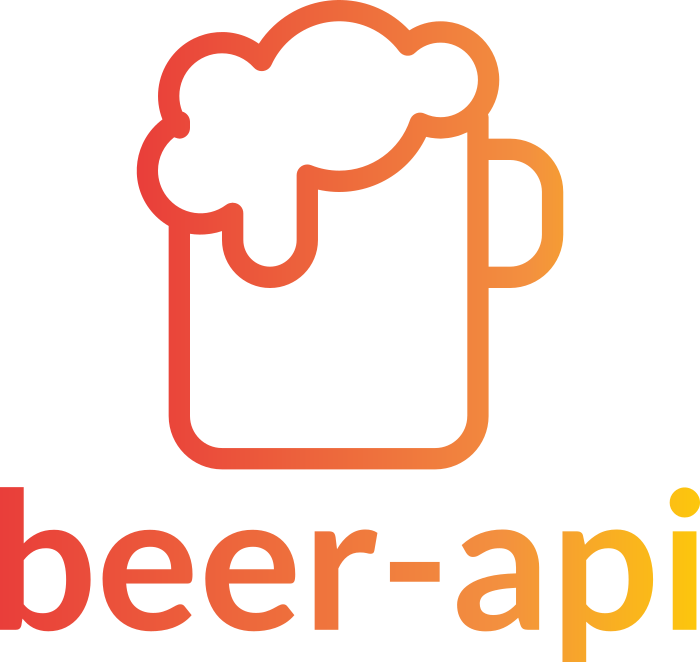

<h4 align="center">
  
</h4>

<div align="center">

[Built With](#built-with) | [Getting Started](#getting-started) | [Installation](#installation)

[:es:][readme-es] | [:us:][readme-en]

[![Build Status][travis-ci]][travis-ci]

</div>
beer-api is a REST API for a beer consumption logging application developed during my recruitment process at La Creativería.

## Built With

It was developed using amazing technologies:

- [Node JS](https://nodejs.org/es/)
- [Express](https://expressjs.com/)
- [JSON Web Tokens](https://jwt.io/)
- [Mongoose](https://mongoosejs.com/)
- And more...

## Getting Started

### Installation

**Step 1:** Clone or download the [repo](https://github.com/bryandms/beer-api).

<br />

**Step 2:** Switch to your repository's directory.

```bash
cd /path/to/your/repo
```

<br />

**Step 3:** Install dependencies.

```bash
npm install
```

<br />

**Step 4:** Duplicate the .env-example file and rename it to .env and change the environment variables.

```bash
cp .env.example .env
```

<br />

**Step 5:** Run the server.

```bash
npm run dev
```

Icons made by <a href="https://www.flaticon.com/free-icon/beer_961465" title="itim2101">itim2101</a> from <a href="https://www.flaticon.com/" title="Flaticon"> www.flaticon.com</a>

[travis-ci]: https://travis-ci.com/bryandms/beer-api.svg?token=6SGDZP6Zdeh3xDyEv1ZB&branch=master
[readme-es]: https://github.com/bryandms/beer-api/blob/master/README-ES.md
[readme-en]: https://github.com/bryandms/beer-api/blob/master/README.md
